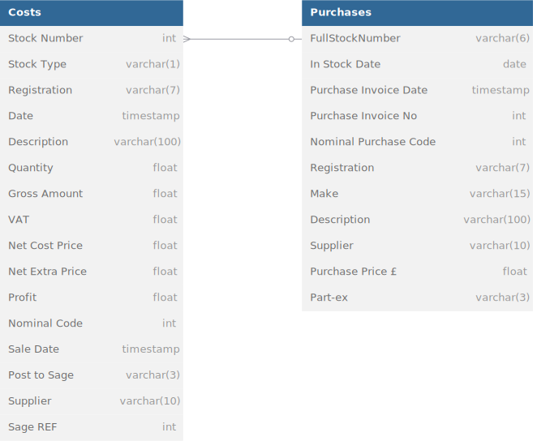
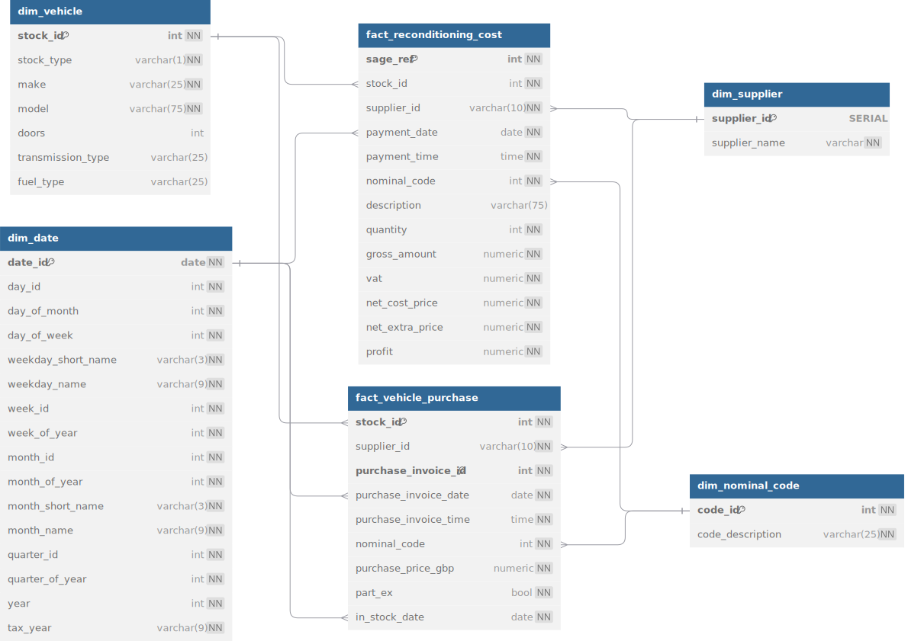
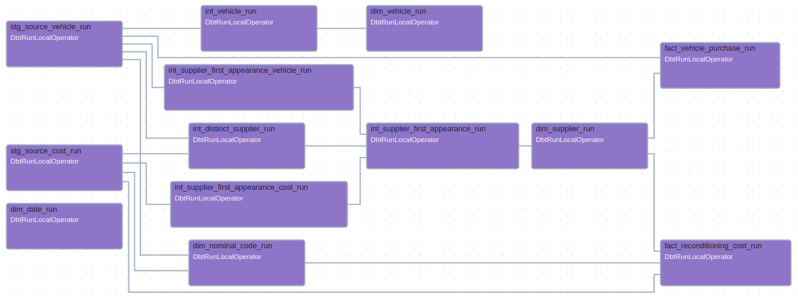
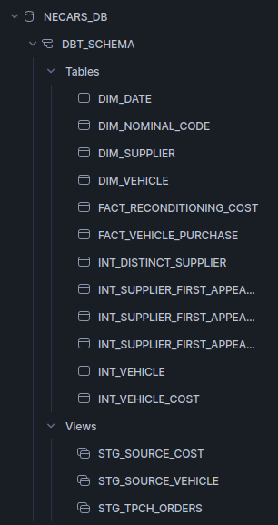
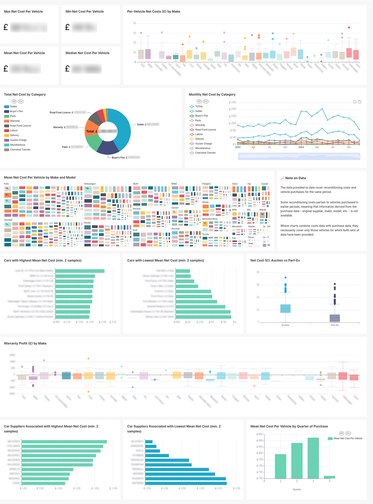

# ELT Pipeline for NE Cars (Work in Progress)

An ELT pipeline using dbt, Snowflake and Apache Airflow, for a local used car dealership.

## 🌐 Overview

NE Cars (name changed) is a car dealership based in the North of England. They buy nearly new used cars at auction and recondition them for sale at a profit, as well as paying for repairs on warranties down the line.

NE Cars' accountants want to perform data analysis on these reconditioning and repair costs, gaining insight into changes in expenditure and profitability over time, correlations between cost and supplier or between cost and car make/model, and so on. However, the company's present systems only make certain fairly rigid queries available. Variability of data input style on the part of the sales personnel represents another limitation on present querying power.

The goal is to build an ELT pipeline according to good data warehousing principles, in order both to answer the accountants' questions now (the MVP) and to automate the loading of new data into the system in future, with an API and dashboard facilitating future queries by data analysts.

Stack:
- **dbt (data build tool)** for data transformation
- **Snowflake** as the data platform
- **Apache Airflow** for orchestration
- **Apache Superset** for dashboarding

## 🗃️ Source Data

The results of two queries in the existing system, one focused on vehicle purchases and the other on reconditioning costs, are output as CSVs with the following schema. These are loaded into Snowflake.

These CSVs contain tens of thousands of lines. At the discovery stage, I analysed this data using **Jupyter Notebook** and **pandas** (notebook not included here for confidentiality reasons) and various **SQL queries in Snowflake** (viewable [here](./discovery/costs_discovery_queries.sql)), identifying the following pain points:

1. **Imperfect correspondence of datasets**. The CSVs are filtered by time period. Costs can be incurred some time after purchase, so there are vehicles referenced in the costs data set for which we lack purchase data (including make, model, original supplier, etc.).
2. **Imperfect correlation of nominal code to cost description**. Most cost codes stably correspond to a given cost type, without exceptions, but one code, `5302`, is used in practice as a 'Miscellaneous' category. In a number of cases costs that should belong to other cost codes have also been erroneously associated with it.
3. **Free-text / incomplete vehicle descriptions**. Vehicle descriptions have been stored as single strings, in the rough format, `"[vehicle model] [no. of doors] [transmission type] [fuel type]"`. Sometimes, transmission type or fuel type may be missing, or the number of doors may be given as 0.
4. **Stock number embedded in string**. The identifier common to the two CSVs is the vehicle stock number, but in `Purchases` that number is embedded in a string combining what in `Costs` are the `Stock Type` and `Stock Number`.
   
## 🎇 Transformed Schema

The transformed dimensional data schema is as follows.

The string `description` column from the `Purchase` source table is parsed into separate `model`, `doors`, `transmission_type` and `fuel_type` columns in the `dim_vehicle` table.

Nominal codes are removed to a dimension table, while a `description` column is retained in the `fact_reconditioning_cost` table for use with the `Miscellaneous` nominal code, `5302`.

Dates are denormalized into a classic date dimension table allowing query by month name, quarter, etc.

## 🌬️❄️ Orchestration

dbt enables clear, easy modularisation and referencing, allowing intermediate stages in the data transformation process to be broken down into individual models with a definite order of execution. The resulting DAG is then orchestrated and automated using Airflow, with execution in the project's Snowflake warehouse.

## 📈 Dashboard

An Apache Superset dashboard is connected to the Snowflake warehouse using Snowflake SQLAlchemy. Charts provide clear, intuitive visualizations of the results of complex queries, allowing reconditioning costs to filtered by category, tracked over time, or even grouped by vehicle stock ID and further analyzed in terms of their relationship to vehicle manufacturer, model, etc. Drilling across fact tables allows further analysis in terms of vehicles' original suppliers or original circumstances of purchase.

